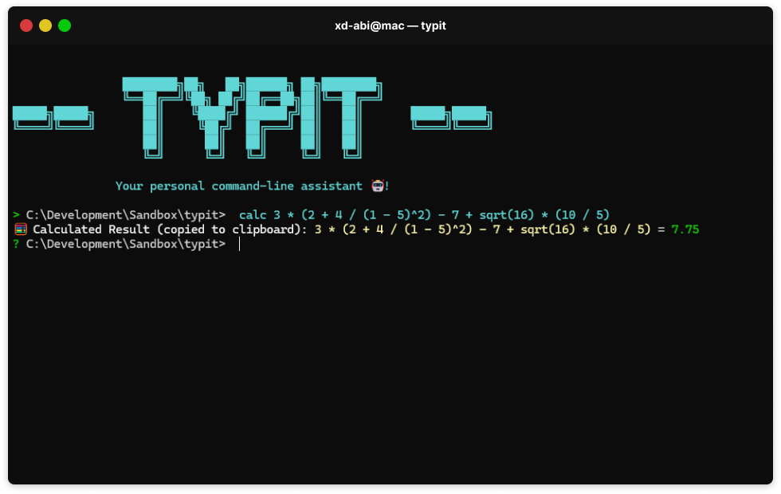

# 🤖 Typit



**Typit** is a powerful terminal extension built in Rust, offering a variety of utility tools and beautiful color formatting for enhanced command-line experiences. It allows you to seamlessly integrate common terminal operations like mathematical calculations, hashing, directory navigation, and more with a stylish interface!

## 🚀 Installation & Setup

Follow these steps to build and run Typit on your machine:

```bash
git clone https://github.com/xd-Abi/typit.git
cd typit
cargo run --release
```

## 🔧 Available Commands

Typit offers the following built-in commands:

- **🧮 `calc`**: Evaluate mathematical expressions.
- **🔐 `hash`**: Generate cryptographic hashes for files and strings.
- **🌐 `mac`**: Display all MAC addresses of the system’s network interfaces.
- **🔑 `pwd`**: Generate secure passwords and copy them to the clipboard.
- **📁 `cd`**: Change directories within the program.
- **👋 `exit`**: Exit the Typit interface.
- **⚙️ Native Commands**: Typit will automatically run any native CLI tool if it does not match one of the custom commands (e.g., `flutter doctor` or `git status`).

## 💡 How It Works

1. **Command Matching**: Typit first checks for built-in commands (e.g., `calc`, `hash`) before falling back to executing native commands installed on your system.
2. **Dynamic Directory Navigation**: Commands like `cd` will change the Rust process’s working directory, similar to native shells.
3. **Enhanced Output**: Typit uses rich colors and icons to make the command-line experience more enjoyable.

## 🛠️ Utility Tool Overview

### `calc`

Calculate mathematical expressions directly from the terminal. Supports basic arithmetic and more advanced operations like `sqrt(16)` or `5 * (2 + 3)`.

```bash
> calc 5 + 3 * 2
🧮 Calculated Result (copied to clipboard): 5 + 3 * 2 = 11
```

### `hash`

Generate hashes for text strings or files using multiple algorithms like `SHA-256` or `MD5`.

```bash
> hash str hello world
🔐 SHA-256 Hash (copied to clipboard): 2cf24dba5fb0a30e26e83b2ac5b9e29e1b161e5c1fa7425e73043362938b9824
```

### `mac`

Display the primary MAC addresses on the system.

```bash
> mac
🌐 Your Mac address (copied to clipboard): 8C:B8:7E:A0:70:67
```

### `pwd`

Generate strong, random passwords with ease.

```bash
> pwd gen 15
🔑 Generated Password (copied to clipboard): 3Lg!1Z$AQ^AwJ1%
```

### `cd`

Change the working directory within Typit.

```bash
> cd /Users/username/Documents
📂 Directory changed to: /Users/username/Documents
```

## 🌐 Native Command Integration

If Typit does not match any built-in command, it will attempt to run native commands installed on your system:

```bash
> git status
On branch main
Your branch is up to date with 'origin/main'.

nothing to commit, working tree clean
```

## ✨ Color and Style Customization

Typit uses the `colored` library to create a visually appealing interface with vibrant colors for better readability and organization. Each command has its own unique icon and style for better visual distinction.

## 📜 Command Guidelines

1. **Built-In Commands**: Use Typit's internal commands like `calc`, `pwd`, or `cd` for quick operations.
2. **Native Commands**: If a command is not recognized, Typit will pass it to the system shell (e.g., `flutter`, `ls`, or `git`).
3. **Error Handling**: Typit provides meaningful error messages when a command is not found or executed incorrectly.

## 🔧 Technical Details

- **Rust**: The core of Typit is built in Rust, ensuring high performance and safety.
- **Colored**: Colorizes the terminal output to enhance readability.
- **Inquire**: Handles dynamic prompts and input management.
- **std::process::Command**: Executes native commands.
- **Clipboard Support**: Automatically copies results to the clipboard for certain operations (e.g., `calc` results).

## 📜 Future Features

- **Dynamic Plugins**: Add and manage custom commands on-the-fly.
- **Shell Integration**: Provide better support for running interactive shell commands.
- **Command Autocompletion**: Include support for autocompleting common commands.
- **Cross-Platform Enhancements**: Improve compatibility on Windows, macOS, and Linux.
- **Arrow Key Command Navigation**: Implement support for navigating through command history using the ↑ and ↓ arrow keys.
